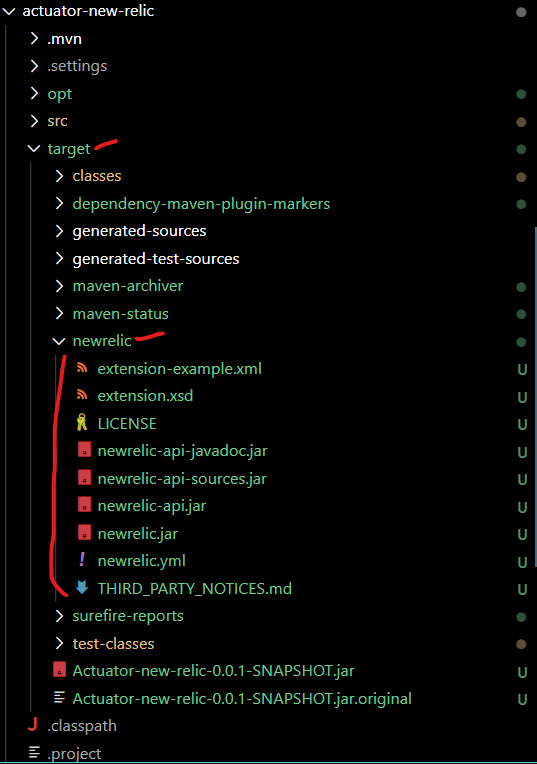
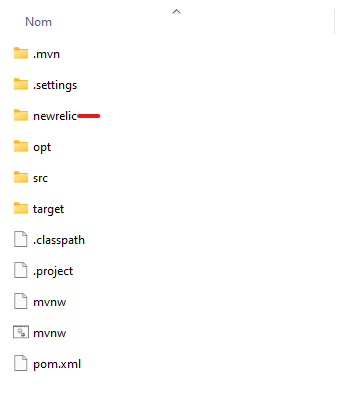
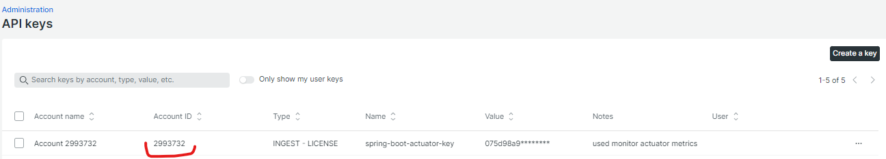
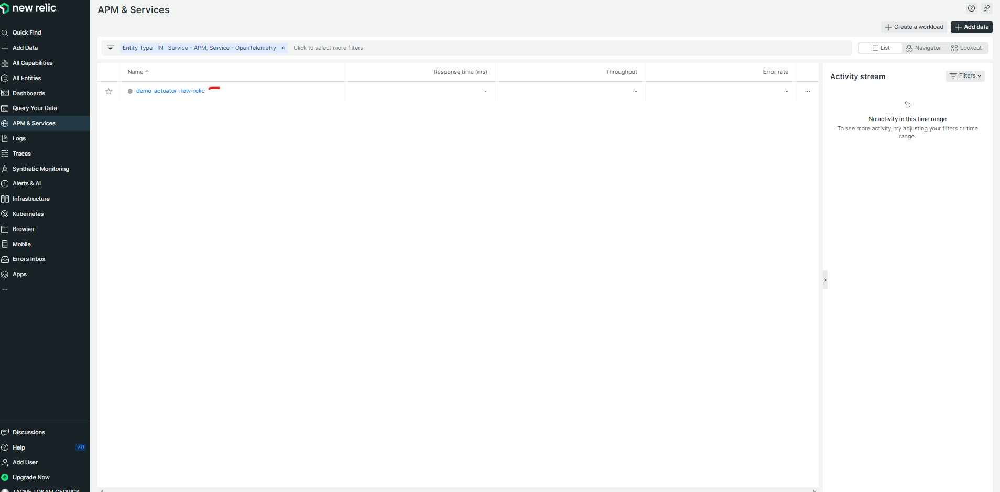

# Integrating Spring Boot Actuator with New Relic: Enhanced Application Monitoring

In today's dynamic software landscape, ensuring the performance, reliability, and availability of your applications is crucial. Developers and operations teams require comprehensive insights into an application's behavior and health to proactively manage and optimize its performance. This is where Spring Boot Actuator, in combination with New Relic, comes into play, offering a robust solution for advanced application monitoring and management. In this article, we will delve into the integration of Spring Boot Actuator with New Relic, highlighting the benefits of this combination and guiding you through the implementation process.

# Add Spring Boot Actuator to your Project

We have a complete article about Spring Boot Actuator and his integration in a Spring Boot Project here (link to the previous article)

# The Power of New Relic

New Relic is a leading application performance monitoring (APM) tool that enables organizations to monitor and manage the performance of their applications and infrastructure. New Relic provides comprehensive insights into application performance, user experience, and resource utilization. With features like real-time monitoring, customizable dashboards, and advanced analytics, New Relic empowers teams to detect and resolve issues quickly, ensuring optimal user experiences.

# Integrating Spring Boot Actuator with New Relic

Integrating Spring Boot Actuator with New Relic enhances your application monitoring capabilities, allowing you to leverage the strengths of both tools. The integration involves using Actuator's endpoints to expose application metrics and health data, which can then be collected and visualized in the New Relic platform.

We will go Through 4 steps of integration depending on our needs:

## 1. Create Spring Boot Application

You can follow our article (Spring Boot Actuator) to learn how to add Actuator to a Spring Boot app, Or you can just

- Create a new Spring Boot from SpringBoot Initialzr (https://start.spring.io/)
- Use your existing Spring Boot application

You can also just follow this tutorial, in the next step you will have details on how to add Spring Boot Actuator to your project

## 2. Configure New Relic

If you don't already have a New Relic account, you'll need to sign up for one. Go to https://newrelic.com and click on "Sign Up" or "Get Started for Free" to create an account.

### Generate New Relic API Key

Once connected,

- Open the administration tab by clicking on your account name at the bottom left  then  **"API Keys"**


- Fill out the form to create your API Key, (Note: You should select the key type: Ingest License) and click on Create a key


If you want to read more about New Relic API key, you can check this [link](https://docs.newrelic.com/docs/apis/intro-apis/new-relic-api-keys/).

### Configure Maven to download and unzip the new Relic Agent

To collect data, New Relic uses an agent that collects required data and sends it to New Relic. In this section, we will go through the steps to use Maven to download and unzip the agent.

- Add Maven snippet to download the Java Agent _newrelic-java.zip_

in your pom.xml under dependencies add the following content:

```xml
<!-- pom.xml-->
<dependency>
    <groupId>com.newrelic.agent.java</groupId>
    <artifactId>newrelic-java</artifactId>
    <version>JAVA_AGENT_VERSION</version>
    <scope>provided</scope>
    <type>zip</type>
</dependency>
```

Replace 'JAVA_AGENT_VERSION' with [the latest Java agent version.](https://docs.newrelic.com/docs/agents/java-agent/getting-started/java-release-notes/)

- Configure Maven to unzip _newrelic-java.zip_

Now that Maven will be able to download the latest version of New Relic Agent, let's add the necessary plugin to unzip it.

To do that add the following code to your _pom.xml_ under _maven-dependency-plugin_.

```xml
<!-- pom.xml-->
<plugin>
	<groupId>org.apache.maven.plugins</groupId>
	<artifactId>maven-dependency-plugin</artifactId>
	<version>3.1.1</version>
	<executions>
		<execution>
			<id>unpack-newrelic</id>
			<phase>package</phase>
			<goals>
				<goal>unpack-dependencies</goal>
			</goals>
			<configuration>
				<includeGroupIds>com.newrelic.agent.java</includeGroupIds>
				<includeArtifactIds>newrelic-java</includeArtifactIds>
				<!-- you can optionally exclude files -->
				<!-- <excludes>**/newrelic.yml</excludes> -->
				<overWriteReleases>false</overWriteReleases>
				<overWriteSnapshots>false</overWriteSnapshots>
				<overWriteIfNewer>true</overWriteIfNewer>
				<outputDirectory>${project.build.directory}</outputDirectory>
			</configuration>
		</execution>
	</executions>
</plugin>
```

- Check our confirgurations

To make sure everything is well configured for Maven to download the New Relic agent, run the following command

```bash
mvn clean install
```

If everything is fine, you should have under the folder target, a generated directory named _newrelic_



### Configure the New Relic properties file with project data

In the generated new relic folder under target, you will notice a file named: _newrelic.yml_. This file will be used to configure the New Relic agent.

Many things can be configured but for now, the only parameters that are interesting for us are _license_key_ and _app_name_.

Replace <%= license_key %>' with the value of the key ID from the API key we created earlier.


and the _app_name_ by the name of your app (it will be used to identify data coming from your app on New Relic, It should be unique and meaningful to you).

You can have more details about other config attributes [here](https://docs.newrelic.com/docs/apm/agents/java-agent/configuration/java-agent-configuration-config-file/)

- Move New relic to a more permanent folder

Since _target_ folder is a temporary folder and can be deleted every time we run Maven clean, we should move it to a more persistent directory, I put it in the root folder of the project so now the folder structure is:



### Configure Spring Boot Actuator

To fully integrate Spring Boot Actuator with New Relic, you can configure a few Actuator-specific properties in your application.properties or application.yml file.

```properties
management.newrelic.metrics.export.api-key=YOUR_KEY
management.newrelic.metrics.export.account-id=YOUR_ACCOUNT_ID
management.newrelic.metrics.export.newrelic.enabled=true
```
Get your YOUR_NEW_RELIC_ACCOUNT_ID from the same New Relic API Keys page:



Just a quick reminder, You have to add actuator dependency in pom.xml as follows

```xml
<!-- pom.xml-->
<dependency>
	<groupId>org.springframework.boot</groupId>
	<artifactId>spring-boot-starter-actuator</artifactId>
</dependency>
```

### Testing our configuration

To test our configuration, we have to rebuild our project to take into consideration changes and run it by passing the ```-javaagent``` argument to Spring Boot as follows:

```bash
mvn clean install
cd target
java -javaagent:../newrelic/newrelic.jar -jar Actuator-new-relic-0.0.1-SNAPSHOT.jar
```
replace Actuator-new-relic-0.0.1-SNAPSHOT by your custom-generated Spring Boot App.

To validate that everything is working fine, go to [New Relic APM Summary page](https://one.newrelic.com/nr1-core?filters=%28domain%20IN%20%28%27APM%27%2C%20%27EXT%27%29%20AND%20type%20IN%20%28%27APPLICATION%27%2C%20%27SERVICE%27%29%29&state=f1dfd001-1723-431e-5412-33488d36fce8). 
You should see your application's name *(the application name you set in newrelic.yml)*


If you are not seeing your app in APM Summary Page, you can check what's the issue in **New Relic Agent Log file* in *newrelic/logs/newrelic_agent.log*

The configuration we did here is not the only way to configure and can vary depending on your production environment and/or app server.
You can follow steps depending on your environment [here.](https://docs.newrelic.com/install/java/)


Now that all things are set, let's dive into sending data to New Relic

## 3. Sending Spring Boot Actuator Metrics to New Relic

 New Relic registry periodically pushes metrics to New Relic. To export metrics to New Relic, you must provide your API key and account ID, which we did already at [Configure Spring Boot Actuator.](#configure-spring-boot-actuator)

